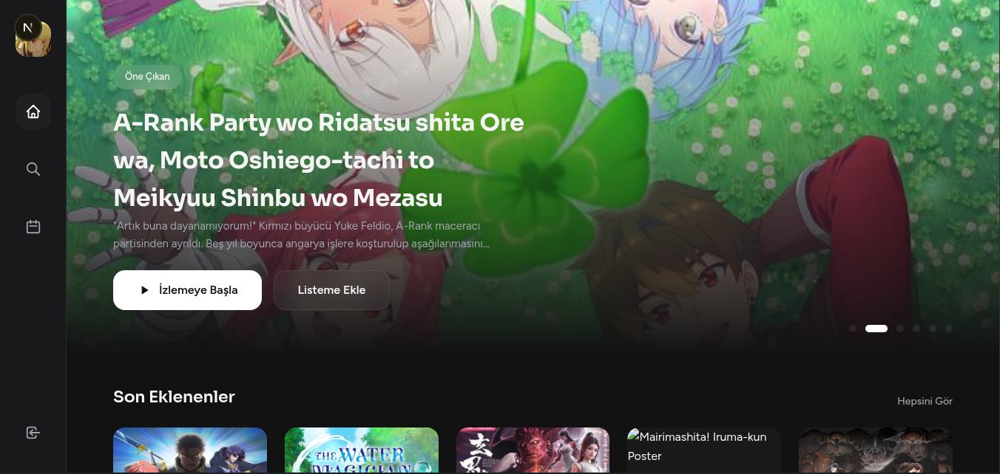
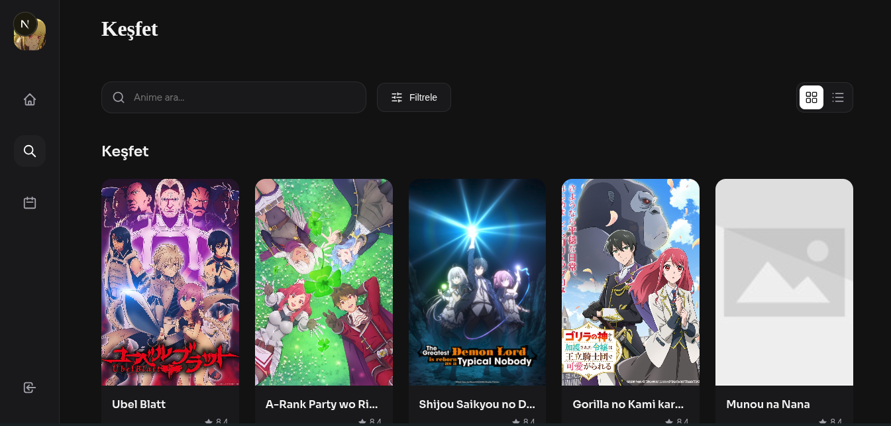
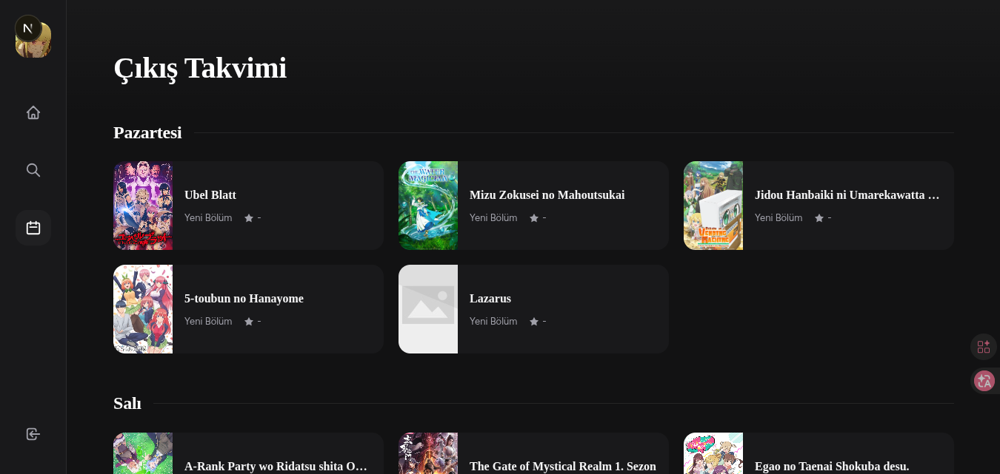
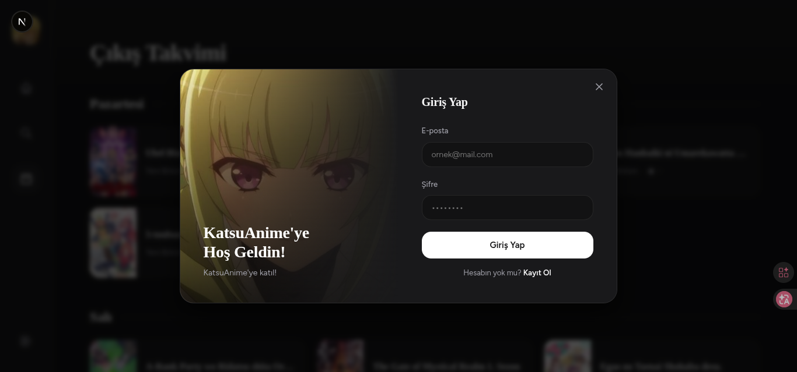

# KatsuAnime

<div align="center">


</div>

KatsuAnime is a modern web application designed for anime lovers.

Features:
- Watch anime
- Discover and search anime
- Anime calendar
- Modern and responsive design

---

## Screenshots

<details>
<summary>View Screenshots (Click)</summary>
<p align="center">
<br>
<b>Home Page</b><br>

<br><hr><br>
<b>Search Page</b><br>

<br><hr><br>
<b>Calendar Page</b><br>

<br><hr><br>
<b>Login Panel</b><br>

</p>
</details>

---


## Project Structure

```
katsuanime/
│
├── src/
│   ├── app/                          # Next.js App Router pages
│   │   ├── page.tsx                 # Home page
│   │   ├── kesfet/                  # Anime discovery page
│   │   ├── profil/                  # User profile page
│   │   ├── ayarlar/                 # Settings page
│   │   ├── takvim/                  # Anime calendar page
│   │   ├── anime/[slug]/            # Anime detail page
│   │   ├── izle/[slug]/[episode]/  # Anime player page
│   │   ├── p/[username]/            # User profile page
│   │   ├── layout.tsx               # Global layout
│   │   ├── globals.css              # Global styles
│   │   ├── ui.css                   # UI component styles
│   │   └── page.module.css          # Page specific styles
│   │
│   ├── components/                  # React components
│   │   ├── auth/
│   │   │   ├── AuthModal.tsx        # Login/Register modal
│   │   │   └── AuthContext.tsx      # Authentication context
│   │   ├── ui/
│   │   │   ├── Modal.tsx            # Reusable modal
│   │   │   ├── KatsuPlayer.tsx      # Video player component
│   │   │   └── Toast.tsx            # Notification component
│   │   ├── layout/
│   │   │   └── Sidebar.tsx          # Sidebar navigation
│   │   └── home/
│   │       ├── Hero.tsx             # Home page hero section
│   │       ├── AnimeCard.tsx        # Anime card component
│   │       ├── AnimeHorizontalCard.tsx  # Horizontal anime card
│   │       └── AnimeGrid.tsx        # Anime grid layout
│   │
│   ├── lib/                         # Utility functions and APIs
│   │   ├── api/
│   │   │   ├── config.ts            # API configuration
│   │   │   ├── anime.ts             # Anime API calls
│   │   │   └── katsu.ts             # KatsuAnime API operations
│   │   ├── types/
│   │   │   └── anime.ts             # TypeScript type definitions
│   │   └── api.ts                   # General API functions
│   │
│   └── ...
│
├── public/                          # Static files
│   ├── logo.jpeg                   # Application logo
│   ├── next.svg                    # Next.js icon
│   ├── vercel.svg                  # Vercel icon
│   ├── globe.svg                   # Globe icon
│   ├── window.svg                  # Window icon
│   └── file.svg                    # File icon
│
├── .vscode/                        # VS Code configuration
│   └── settings.json               # Editor settings
│
├── .next/                          # Next.js compiled output (prod)
├── .vercel/                        # Vercel deployment config
│
├── package.json                    # Project dependencies
├── package-lock.json               # Dependency lock file
├── tsconfig.json                   # TypeScript configuration
├── eslint.config.mjs               # ESLint linter configuration
├── next.config.ts                  # Next.js configuration
├── next-env.d.ts                   # Next.js TypeScript definitions
├── .gitignore                      # Git ignore rules
├── .env                            # Environment variables
└── README.md                       # This file
```

### Dependencies

**Production Dependencies:**
- `next@16.1.6` - React framework
- `react@19.2.3` - UI library
- `react-dom@19.2.3` - React DOM
- `lucide-react@1.8.0` - Icon library

**Development Dependencies:**
- `typescript@5` - Type checking
- `eslint@9` - Code quality
- `@types/*` - TypeScript type definitions

---

## Installation

### Requirements
- Node.js 18.0+
- npm or yarn

### Steps

```bash
# Clone the repository
git clone https://github.com/username/katsuanime.git
cd katsuanime

# Install dependencies
npm install

# Set up environment variables
cp .env.example .env.local
```

---

## Development

### Start Development Server

```bash
npm run dev
```

Open `http://localhost:3000` in your browser.

### Code Linting

```bash
npm run lint
```

### Production Build

```bash
npm run build
npm start
```

---

## License

This project is distributed under the **GPL v3** license.

For more information about the GPL v3 license, visit the [LICENSE](./LICENSE) file or the [GNU GPL v3](https://www.gnu.org/licenses/gpl-3.0.html) official page.

### License Summary
- Free software
- Source code access
- Right to modify
- Right to redistribute
- Distribution under the same license is required

---

## Contributing

Your contributions are welcome! Please:

1. Fork the repository
2. Create a feature branch (`git checkout -b feature/AmazingFeature`)
3. Commit your changes (`git commit -m 'Add some AmazingFeature'`)
4. Push to the branch (`git push origin feature/AmazingFeature`)
5. Open a Pull Request
